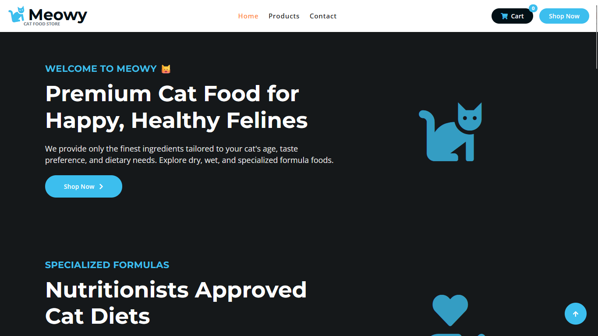
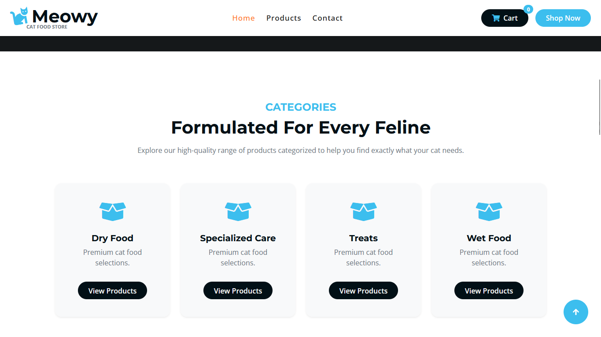
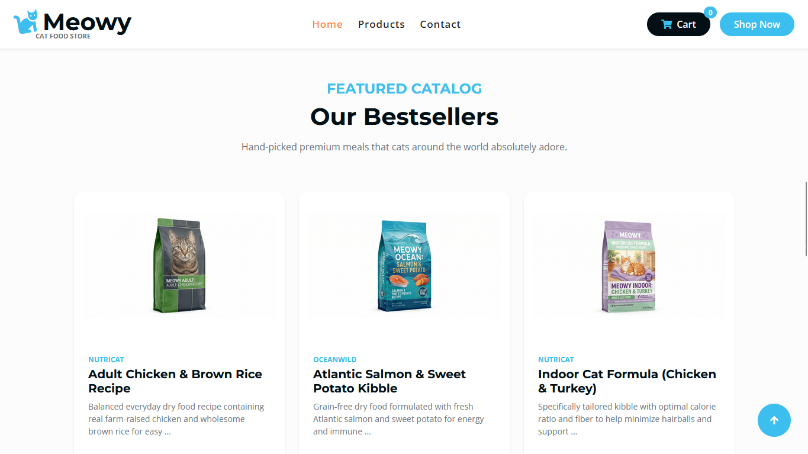
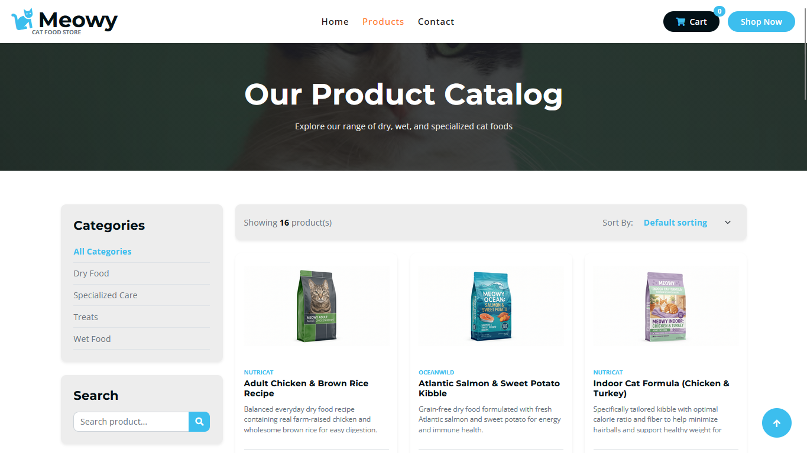
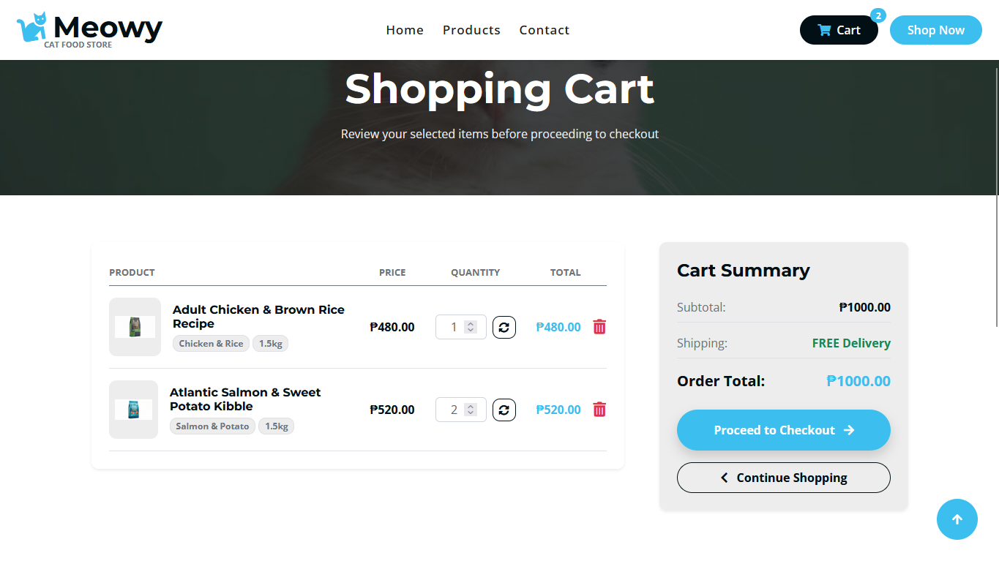
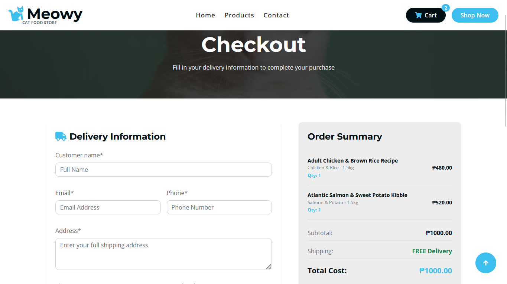
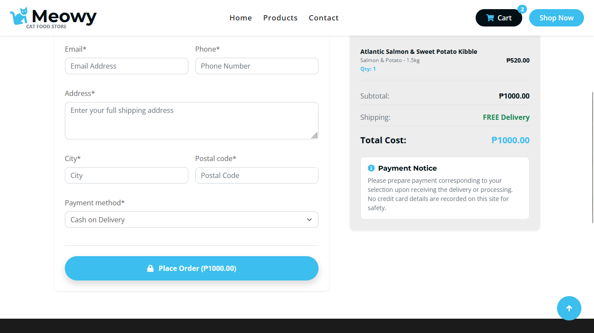

# Meowystore

[](https://www.python.org/)
[](https://www.djangoproject.com/)
[](https://getbootstrap.com/)
[](https://www.sqlite.org/)
[](#)

> **Live Deployment:** [https://meowystore.pythonanywhere.com](https://meowystore.pythonanywhere.com)

---

## 🐾 Project Overview

**Meowystore** is a premium, dedicated online cat food e-commerce platform built as a private academic project. The application features a robust server-side database integration designed to handle live catalog inventory, dynamic product variations, session-based customer shopping carts, and a secure checkout pipeline. It provides a complete, modern MVP user flow designed with visually striking aesthetics tailored for feline nutrition enthusiasts.

---

## 🛠️ Tech Stack

| Component | Technology | Purpose & Details |
| :--- | :--- | :--- |
| **Backend Framework** | Python 3.11+ / Django 5.x | High-performing server-side framework handling routing, models, and business logic. |
| **Database** | SQLite (Server-Side) | Relational database storage managing structured categories, products, variants, and checkout orders. |
| **Frontend Layout** | Bootstrap 5 / Custom CSS3 | Modern, responsive grid-based components and visual styling overriding standard template variables. |
| **Env Management** | `python-dotenv` | Clean segregation of environment variables (`DEBUG`, `SECRET_KEY`) for secure configurations. |
| **Image Processing**| `Pillow` | Backend library enabling server-side product image uploads and model verification. |

---

## 🔄 User Flow & Key Features

*   **Browse Curated Catalog:** Navigate through distinct categories of feline products including *Treats*, *Wet Food*, *Dry Food*, and *Specialized Care*.
*   **Detailed Product Pages:** Review detailed descriptions, brands, and real-time database stock checks for each individual flavor and weight variant.
*   **Session-Based Shopping Cart:** Add, update quantities, or remove items dynamically. The cart utilizes persistent session-based lookups, allowing anonymous users to manage their selections seamlessly without needing authentication.
*   **Server-Side Checkout:** Submit contact information and delivery details. The application processes checkout details atomically to adjust variant inventory levels and save final order items securely in the database.
*   **Secure Administration:** Access the Django admin backend to manage categories, products, variants, and review customer orders.

---

### Screenshots

*Placeholders for interface screenshots. Replace the image links with your own captures:*

#### 🏠 Homepage / Product Grid




*Visual layout of categories and products grid display.*

#### 🛒 Shopping Cart Summary View

*Interface reviewing customer selections, quantities, and totals.*

#### 📝 Checkout Form Page


*Form validating customer shipping information and total purchase cost.*

---

## 💻 Local Installation & Setup Guide

Ensure you have Python 3.11+ installed on your system.

### 1. Clone & Navigate to Folder
Clone the repository or navigate to the directory where the project is saved:
```bash
cd Meowy
```

### 2. Set Up Virtual Environment
Create a clean virtual environment and activate it:
*   **Windows:**
    ```bash
    python -m venv venv
    venv\Scripts\activate
    ```
*   **macOS / Linux:**
    ```bash
    python3 -m venv venv
    source venv/bin/activate
    ```

### 3. Install Dependencies
Change directory into the Django project root folder containing `manage.py` and install the package requirements:
```bash
cd projectsite
pip install -r requirements.txt
```
*(Dependencies installed: `django>=5.0,<6.0`, `Pillow`, `python-dotenv`, `django-crispy-forms`, `crispy-bootstrap5`)*

### 4. Create Local Environment Variables
Create a file named `.env` in the `projectsite/` directory (alongside `manage.py`):
```env
DEBUG=True
SECRET_KEY=your-local-development-secret-key
```

### 5. Run Database Migrations
Apply existing migrations to set up your local SQLite database:
```bash
python manage.py migrate
```

### 6. Create Superuser (Admin Account)
Create an administrative account to access the backend admin panel:
```bash
python manage.py createsuperuser
```

### 7. Run the Development Server
Launch the local web server:
```bash
python manage.py runserver
```
Visit the project at [http://127.0.0.1:8000/](http://127.0.0.1:8000/).

---

## ☁️ Deployment Details (PythonAnywhere)

The application is deployed live on PythonAnywhere.

### Static & Media Asset Configuration
To correctly map static files and media assets in the PythonAnywhere **Web Tab**, the following paths are configured:

| URL Path | Directory Path |
| :--- | :--- |
| `/static/` | `/home/meowystore/Meowy/projectsite/staticfiles/` |
| `/media/` | `/home/meowystore/Meowy/projectsite/media/` |

> 💡 **Note:** When deploying, always run `python manage.py collectstatic` inside the PythonAnywhere console to compile all design assets into the `/staticfiles/` target directory.

### Environment Variable Loading
Environment variables (such as `DEBUG` and `SECRET_KEY`) are dynamically loaded during startup by initializing `load_dotenv()` in the PythonAnywhere WSGI configuration file or at the top of the `settings.py` script.

---

## 🔮 Project Context

### 🚀 Future Roadmap
- [ ] **Stripe Payment Integration:** Secure and functional credit card transaction processing.
- [ ] **User Authentication & Accounts:** User login, purchase history tracking, and saved delivery profiles.
- [ ] **Order Tracking Dashboard:** Live order status check (Processing, Shipped, Delivered) for customers.

### Members
* Castillo, Kenneth Vincent B.
* Malate, Juan Miguel M.

### 📄 License
This project is a **Private Academic Project**. All rights reserved. No part of this repository may be reproduced, distributed, or transmitted in any form or by any means for commercial or public usage without prior explicit consent.
